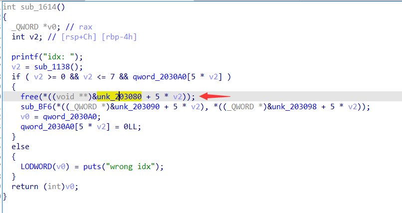
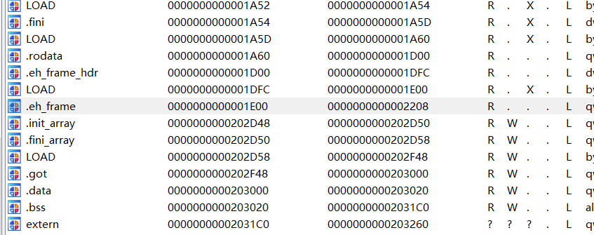
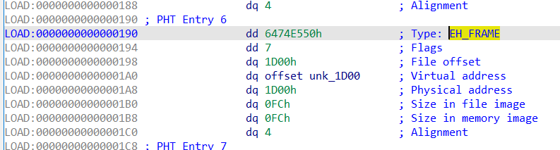
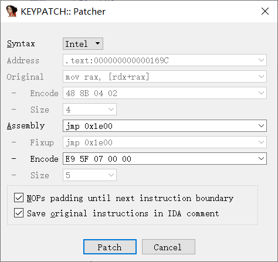
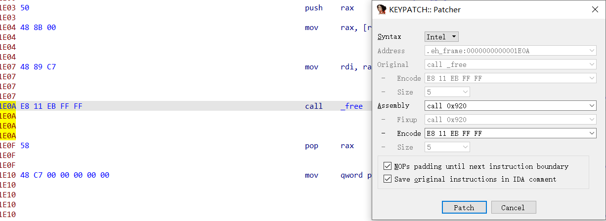

### Ciscn2022 UAF

漏洞在`sub_1614`函数，`free`之后指针没有置零。



`patch`步骤如下：

- `View->Open subviews->Segments`查看`.eh_frame section`的地址，可以看到是`0x1e00-0x2208`。

  

- 在`IDA Pro`的反汇编窗口的头部找到`.eh_frame`所在的`segment`，并把`flags`字段改成`7`（可读可写可执行）。

  

**`patch`代码**

回到漏洞对应的代码，分析汇编代码。首先获得全局数组`unk_203080`的地址放入`rax`，之后`rax`加上偏移`rdx`将该地址存放的指针赋给`rax`，此时`rax`就是要`free`的指针。为了`patch`我们自然要知道存放指针的地址，对应到汇编代码中就是在执行`0x169c`的代码前的`rdx+rax`。

```assembly
.text:0000000000001695                 lea     rax, unk_203080
.text:000000000000169C                 mov     rax, [rdx+rax]
.text:00000000000016A0                 mov     rdi, rax        ; ptr
.text:00000000000016A3                 call    _free
```

我们使用[keypatch](https://github.com/keystone-engine/keypatch) 从`0x169c`处开始`patch`，首先`jmp`到`.eh_frame`地址，

`.eh_frame section`的汇编指令如下：

```assembly
add rax,rdx  ;存放指针的地址
push rax
mov rax,[rax] ;free的指针
mov rdi,rax
call _free
pop rax
mov qword ptr [rax],0 ;指针置零
jmp loc_16a8 ;返回到原来的代码段
```

其中`call _free`和`jmp loc_16a8`用`keypatch`无法识别，需要换个写法。

对于`call _free`，可以写成`call free@plt`，在这里是`call 0x920`。

而`jmp loc_16a8`改成`jmp 0x16a8`即可，之后`Edit->patch program->apply patches to input file`保存`patch`。

其实`patch`总的来说就两种情况，一种是栈溢出整数溢出这种修改的代码比较少可以直接在原来的`text`段上修改的，另一种类似`UAF`这种需要改动代码比较多，这就需要跳到别的段执行`patch`代码然后再跳回去。

------

